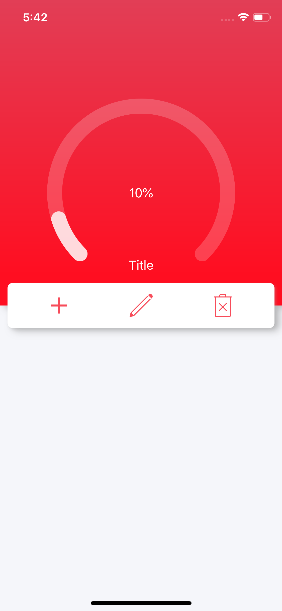
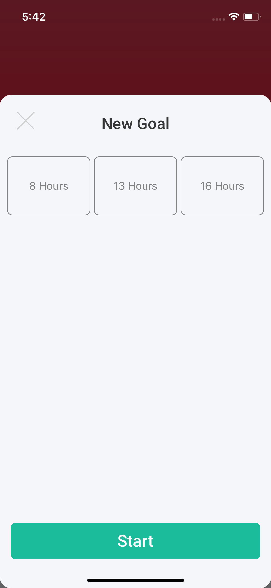

# Interval - Intermittent Fasting app  (Appstore bound)

Basic Overview of the development of an iOS application for iPhone that will be published to the apple appstore after completion of development, and QA. 

## Screenshot Previews:

 
Dashboard design (In development)
   
 
User Input controller (In development)

## App Details:
OS: iOS 12
Device used: iPhone X
Languages: Swift 4, Objective-C (if including dependencies)

#### Interface design and programming: Neftali Samarey
